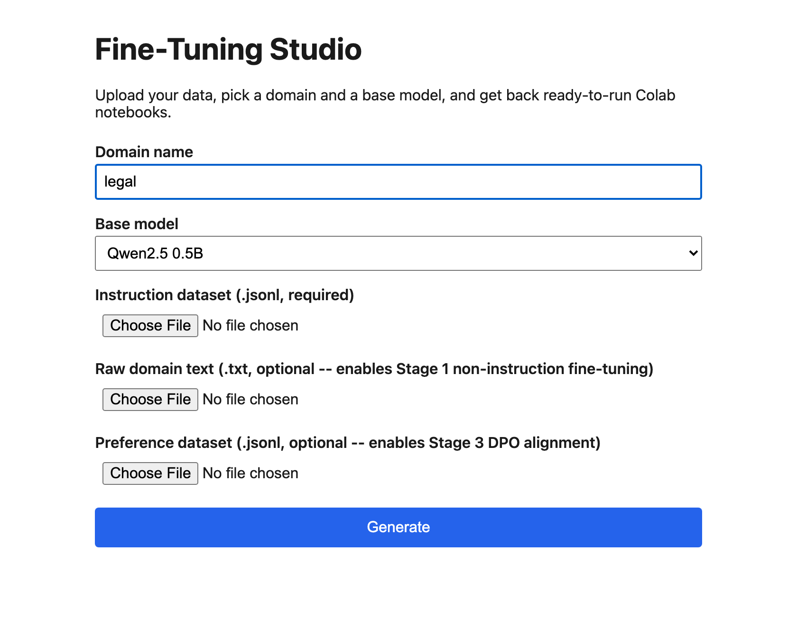

# Fine-Tuning Studio

[](https://github.com/ashwiniadik/fine-tuning-studio/actions/workflows/tests.yml)
[](LICENSE)
[](https://github.com/ashwiniadik/fine-tuning-studio/issues)
[](.github/workflows/tests.yml)
[](https://github.com/ashwiniadik/fine-tuning-studio/commits/main)
[](https://github.com/ashwiniadik/fine-tuning-studio)
[](https://github.com/ashwiniadik/fine-tuning-studio)
[](https://github.com/ashwiniadik/fine-tuning-studio/stargazers)
[](https://github.com/ashwiniadik/fine-tuning-studio/releases/latest)
[](https://github.com/ashwiniadik/fine-tuning-studio/releases/latest)

A web tool that generates ready-to-run Google Colab notebooks for fine-tuning
a small language model on your own dataset, for any domain.



## What this is (and isn't)

This is a **notebook generator**, not a training service. Upload your dataset,
pick a domain name and a base model, and it validates your data and returns a
zip containing the correct Colab notebooks for your data (1, 2, or 3 stages
depending on what you uploaded), pre-filled with the right model, LoRA config,
and file paths. You still run the notebooks yourself on Colab's free GPU tier
-- nothing here executes training, since there is no GPU available to a web
backend running for free.

This generalizes the pipeline built and debugged in
[finance-faq-assistant-finetuning](https://github.com/ashwiniadik/finance-faq-assistant-finetuning):
the notebook templates carry forward every fix found during that project's
code review (correct TRL API usage, correct `packing` setting per stage,
explicit DPO reference model, consistent prompt templates between SFT and DPO)
rather than re-deriving them from scratch.

## How it works

1. Upload an instruction dataset (`.jsonl`, required) and optionally raw domain
   text (`.txt`) and/or a preference dataset (`.jsonl`).
2. The backend validates each file (schema, minimum size, basic quality checks).
3. Based on which files you provided, it picks 1-3 pipeline stages:
   - instruction only -> SFT-only pipeline
   - + raw text -> adds Stage 1 (non-instruction fine-tuning) before SFT
   - + preference data -> adds Stage 3 (DPO alignment) after SFT
4. It generates the corresponding notebook(s) and a README, zips them with your
   data, and returns the zip.
5. You upload that zip's contents to Colab and run it yourself.

## Supported models

Qwen2.5-0.5B, Qwen2.5-1.5B, TinyLlama-1.1B, Llama-3.2-1B -- all verified to fit
a free Colab T4 GPU with Unsloth + QLoRA.

## Dataset formats

| File | Format | Minimum |
|---|---|---|
| Raw domain text | `.txt`, paragraphs separated by blank lines | 10 paragraphs, 15+ words each |
| Instruction dataset | `.jsonl`, `{"instruction": ..., "response": ...}` per line | 20 examples, 5+ word responses |
| Preference dataset | `.jsonl`, `{"prompt": ..., "chosen": ..., "rejected": ...}` per line | 20 examples |

## Running locally

```bash
pip install -r requirements.txt
python3 -m uvicorn backend.app:app --reload
```

Open `http://127.0.0.1:8000`.

## Running the tests

```bash
pip install -r requirements.txt
pytest
```

Unlike the Finance project, every part of this system -- validators, notebook
generation, and the API -- is fully testable locally with no GPU required,
since nothing here executes model training.
